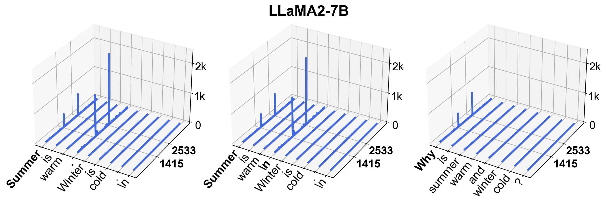

# Massive Activations in Large Language Models

Official PyTorch implementation of our paper:

**Massive Activations in Large Language Models** </br>
[Mingjie Sun](https://eric-mingjie.github.io/), [Xinlei Chen](https://xinleic.xyz/), [J. Zico Kolter](https://zicokolter.com/), [Zhuang Liu](https://liuzhuang13.github.io/) <br>
Carnegie Mellon University, Meta AI Research and Bosch Center for AI  <br>
[Paper](https://arxiv.org/abs/2402.17762) - [Project page](https://eric-mingjie.github.io/massive-activations/index.html)

Most of the experiments in this paper were done on one A6000 GPU.

---
<p align="center">

</p>

This paper studies the existence of *massive activations* in Large Language Models (LLMs). These activations have significantly larger magnitudes than other activations while on the other hand are extremely few in quantity.

## This repository

### Setup 
Installation instructions can be found in [INSTALL.md](INSTALL.md).

### Outline
The contents of this repository are as follows:

* [lib](lib) contains the util function for loading models, plotting figures and evaluation.
* [monkey_patch](monkey_patch) contains the code for monkey patching LLMs with custom forward function, with a goal of collecting internal activation and attention statistics.
* [gpt-2](gpt-2) contains the code for training GPT-2 with explicit attention biases.
* [main_llm.py](main_llm.py) contains the code for reproducing our experiments on LLMs.
* [main_vit.py](main_vit.py) contains the code for reproducing our experiments on ViTs.

### Large Language Models (LLMs)

* We provide an example command to visualize a hidden state feature on the residual stream:
```sh
CUDA_VISIBLE_DEVICES=0 python main_llm.py --model llama2_7b \
    --exp1 --layer_id 2 \
    --savedir results/llm/3d_feat_vis/
```
Running this command will visualize the output feature of layer 2 in LLaMA-2-7B, on the input prompt "*Summer is warm. Winter is cold.\n*". The resulting visualizations are saved in `results/llm/3d_feat_vis/`.

For some LLMs, e.g., LLaMA2-7B, you need to set the argument `--access-token` in order to access the weights.

* We provide an example command to visualize the layerwise top 3 largest activation magnitudes:
```sh
CUDA_VISIBLE_DEVICES=0 python main_llm.py --model llama2_7b \
    --exp2 \
    --savedir results/llm/layerwise/
```
Running this command will visualize the per layer top activation magnitudes. The resulting visualizations are saved in `results/llm/layerwise`.

* We provide an example command to run the intervention analysis:
```sh
CUDA_VISIBLE_DEVICES=0 python main_llm.py --model llama2_7b \
    --exp3 \
    --reset_type set_zero \
    --layer_id 2 \
    --savedir results/llm/intervention_analysis/
```
Here the argument `--reset_type` can be either `set_zero` or `set_mean`. This command will zero the massive activations in the output feature of layer 2 in LLaMA-2-7B. The evaluation results are saved in `results/llm/intervention_analysis`.

* We provide an example command for attention visualization:
```sh 
CUDA_VISIBLE_DEVICES=0 python main_llm.py --model llama2_7b \
    --exp4 \
    --layer_id 3 \
    --savedir results/llm/attn_vis/
```
Running this command will visualize the attention logits (average over attention heads) in layer 3 of LLaMA-2-7B. The visualizations are saved in `results/llm/attn_vis/`.

### Vision Transformers (ViTs)

* We provide an example command for visualizing the activation magnitudes of the output feature of an intermediate layer:
```sh
CUDA_VISIBLE_DEVICES=0 python main_vit.py --model_family dinov2_reg --model_size giant \
    --exp1 \
    --layer_id 40 \
    --savedir results/vit/3d_feat_vis/
``` 

* We provide an example command for visualizing the layer-wise largest activation magnitudes:
```sh
CUDA_VISIBLE_DEVICES=0 python main_vit.py --model_family dinov2_reg --model_size giant \
    --exp2 \
    --savedir results/vit/layerwise/
```

* For reproducing the results of `Fix-Reg-Mean` on [DINOv2-reg](https://arxiv.org/abs/2309.16588), run the following commands:
```sh
for model_size in small base large giant 
do 
CUDA_VISIBLE_DEVICES=0 python main_vit.py \
    --model_family dinov2_reg --model_size ${model_size} --exp3 \
    --reg_feat_mean assets/reg_feat_mean \
    --imagenet_dir [Path to ImageNet validation set] \
    --savedir results/vit/exp4/dinov2_reg_${model_size}
done
```
The argument `--reg_feat_mean` corresponds to the directory containing the mean of the register features at all layers collected over 10k ImageNet training images with data augmentations.

Results
| DINOv2-reg       |   ViT-S  |   ViT-B  |  ViT-L | ViT-G |
|------------------|----------|----------|--------|-------|
| Original         |   81.9   |   84.8   |  86.3  |  87.0 |
| `Fix-Reg-Mean`   |   81.7   |   85.0   |  86.2  |  87.0 |

## License
This project is released under the MIT license. Please see the [LICENSE](LICENSE) file for more information.

## Reference 
```bibtex
@article{sun2024massive,
  title={Massive Activations in Large Language Models}, 
  author={Sun, Mingjie and Chen, Xinlei and Kolter, J. Zico and Liu, Zhuang},
  year={2024},
  journal={arXiv preprint arXiv:2402.17762}
}
```